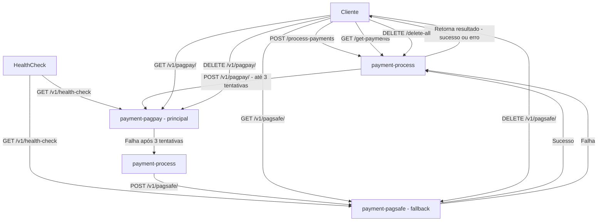

# MultiPay


## Aviso de Segurança

⚠️ **ATENÇÃO:** Este projeto é para fins de estudo e desenvolvimento local.  
As credenciais do banco de dados PostgreSQL (usuário e senha) estão expostas no arquivo `docker-compose.yml` para facilitar o uso local.  
**Não utilize essas credenciais em ambientes de produção ou servidores públicos.**  
Para produção, configure variáveis de ambiente seguras e mantenha as senhas protegidas.

---

## Descrição
MultiPay é um backend que simula um sistema de pagamentos baseado em arquitetura de microsserviços. Ele foi desenvolvido em Java, utilizando PostgreSQL para o banco de dados, Kafka para a comunicação entre serviços e Docker para facilitar o ambiente de desenvolvimento e implantação.

O sistema tem como objetivo demonstrar conceitos de microsserviços, processamento assíncrono e integração entre componentes distribuídos em uma solução de pagamentos.

O serviço central é o `payment-process`, responsável por receber a solicitação de pagamento, persistir no banco e encaminhar a requisição para um dos processadores simulados (`pagpay` ou `pagsafe`) via Kafka ou requisições HTTP. Esses processadores representam gateways de pagamento externos, que apenas recebem e registram os dados.

Além disso, o projeto agora conta com o Health Check, um microsserviço dedicado a monitorar a saúde dos demais serviços (`pagpay` e `pagsafe`). Ele realiza verificações periódicas das rotas de cada serviço, registra a latência (p95) e o status (`UP`, `DEGRADED`, `DOWN`) no banco de dados, permitindo acompanhar de forma centralizada o estado do sistema e garantir que todos os microsserviços estão operando corretamente antes do processamento de pagamentos.

## Pré-requisitos

- **Java JDK 21** — necessário para compilar e rodar os microsserviços localmente, caso não use Docker.
- **Docker** — para rodar os microsserviços em containers.
- **Docker Compose** — para orquestrar os containers facilmente.

## Configurações Importantes

- O projeto utiliza **PostgreSQL 15** com as seguintes credenciais padrão:
    - Usuário: `postgres`
    - Senha: `1234`
- Apache Kafka e Zookeeper usam as versões **7.6.0** da Confluent Platform.
- Variáveis de ambiente configuram o acesso ao banco e Kafka nos microsserviços:
    - `SPRING_DATASOURCE_URL`
    - `SPRING_DATASOURCE_USERNAME`
    - `SPRING_DATASOURCE_PASSWORD`
    - `SPRING_KAFKA_BOOTSTRAP_SERVERS`
- As portas mapeadas no Docker Compose são:
    - **5432** para PostgreSQL
    - **2181** para Zookeeper
    - **9092** para Kafka
    - **8000** para `payment-process`
    - **8001** para `payment-pagpay`
    - **8002** para `payment-pagsafe`
    - **8003** para `health-check`

  


## Tecnologias Utilizadas
- Java com Spring Boot – linguagem principal do backend
- PostgreSQL – banco de dados relacional
- Apache Kafka – sistema de mensagens para comunicação entre microsserviços
- Docker – containerização para facilitar a execução dos serviços

## Funcionalidades
- Simulação de processamento de pagamentos
- Monitoramento do status dos serviços de pagamento
- Comunicação assíncrona entre serviços via Kafka
- Persistência dos dados de pagamento no PostgreSQL
- Ambiente de execução isolado usando Docker

### 1. Payment Process (`payment-process`)

| Método | Rota               | Descrição                              | Corpo da Requisição                  | Resposta                         |
|--------|--------------------|--------------------------------------|------------------------------------|---------------------------------|
| POST   | `/process-payments` | Processa um pagamento (processamento principal). | JSON `PaymentDto` com dados do pagamento | HTTP 200 OK com mensagem de sucesso |
| GET    | `/get-payments`     | Recupera todos os pagamentos processados.      | —                                  | Lista JSON de objetos `Payment` |
| DELETE | `/delete-all`       | Deleta todos os registros de pagamento.        | —                                  | HTTP 204 No Content (sem corpo)  |


---

### 2. PagPay (`payment-pagpay`)

| Método | Rota                         | Descrição                                    | Corpo da Requisição                  | Resposta                       |
|--------|------------------------------|----------------------------------------------|------------------------------------|-------------------------------|
| POST   | `/v1/pagpay/`        | Recebe e processa uma requisição de pagamento PagPay. | JSON `PaymentDto` com dados do pagamento | HTTP 202 Accepted (sem corpo)  |
| GET    | `/v1/pagpay/`    | Recupera todos os registros de pagamento PagPay.      | —                                  | Lista JSON de objetos `Pagpay`  |
| DELETE | `/v1/pagpay/` | Deleta todos os registros de pagamento PagPay.        | —                                  | HTTP 204 No Content (sem corpo) |

---

### 3. PagSafe (`payment-pagsafe`)

| Método | Rota                          | Descrição                                      | Corpo da Requisição                  | Resposta                       |
|--------|-------------------------------|------------------------------------------------|------------------------------------|-------------------------------|
| POST   | `/v1/pagsafe/`        | Recebe e processa uma requisição de pagamento PagSeguro. | JSON `PaymentDto` com dados do pagamento | HTTP 202 Accepted (sem corpo)  |
| GET    | `/v1/pagsafe/`    | Recupera todos os registros de pagamento PagSeguro.      | —                                  | Lista JSON de objetos `Pagsafe` |
| DELETE | `/v1/pagsafe/` | Deleta todos os registros de pagamento PagSeguro.        | —                                  | HTTP 204 No Content (sem corpo) |

---

### 4. Health Check (`health-check`)


| Método | Rota         | Descrição     | Resposta                      |
|--------|--------------|-----------|-------------------------------|
| GET    | `/v1/health` | Monitora o funcionamento dos serviços de pagamento (`pagpay`, `pagsafe`) e registra latência e status (`UP`, `DEGRADED`, `DOWN`) no banco de dados. | HTTP 200 Accepted             |


---

### Campos do PaymentDto

| Campo      | Tipo           | Descrição                                      | Obrigatório | Valores Possíveis              |
|------------|----------------|------------------------------------------------|-------------|--------------------------------|
| processId  | UUID           | Identificador único do processo (gerado pelo sistema) | Não         | UUID                           |
| username   | String         | Nome do usuário que realizou o pagamento        | Sim         | Qualquer string                |
| name       | String         | Nome do processador (ex: PagPay, PagSafe)       | Não         | Strings definidas no sistema   |
| method     | String         | Método de pagamento                              | Sim         | "CREDIT", "DEBIT", "PIX", etc. |
| amount     | Decimal (BigDecimal) | Valor do pagamento                              | Sim         | Número positivo                |
| tax        | Decimal (BigDecimal) | Taxa aplicada ao pagamento                       | Não         | Número decimal                 |
| total      | Decimal (BigDecimal) | Valor total descontando a taxa                    | Não         | Número decimal                 |
| status     | String         | Status do pagamento                              | Não         | "PENDING", "SUCCESS", "FAILED" |


### Exemplo PaymentDto JSON Body

```json
{
  "username": "user123",
  "amount": 88.32,
  "method": "CREDIT"
}
```

### Exemplo de resposta
```json
{
  "eventId": "9591e705-e6f3-461a-ad32-1f38e213e760",
  "processId": "992dfc6a-6762-4c29-9551-b6ce30ef7fb0",
  "username": "user123",
  "name": "PagPay",
  "methods": "CREDIT",
  "amount": 88.32,
  "tax": 3.53,
  "total": 84.79,
  "status": "SUCCESS",
  "createdAt": "2025-07-09T17:10:22.888460Z"
}
```

## Como Rodar
1. Certifique-se de ter o Docker instalado na sua máquina.

2. Clone o repositório:
```bash
  git clone https://github.com/Aegdae/MultiPay.git
```
3. Navegue até a pasta do projeto e execute o Docker Compose para subir todos os serviços:
```bash
  docker-compose up --build  
```
4. Os microsserviços estarão disponíveis nas portas configuradas no docker-compose.yml.

## Teste Rápido

Após subir os serviços com Docker Compose, você pode testar um pagamento usando `curl`:

```bash
curl -X POST http://localhost:8000/process-payments \
 -H "Content-Type: application/json" \
 -d '{"username":"user123","amount":88.32,"method":"CREDIT"}'
```

## Considerações Finais

MultiPay foi criado como um estudo prático de microsserviços e comunicação assíncrona com Kafka.  
O sistema simula um fluxo realista de pagamentos com orquestração de serviços e persistência em banco de dados.

Este projeto ainda está em evolução e poderá receber melhorias ao longo do tempo.  
Fique à vontade para testar, explorar e contribuir!